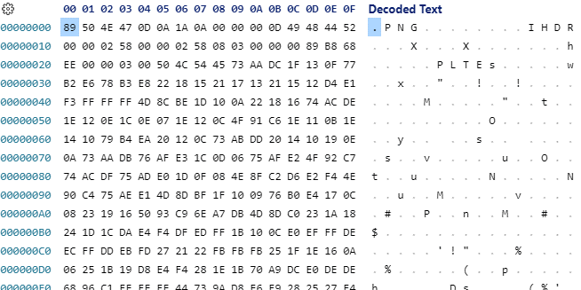

# libpng関数テスター | png_sig_cmp

libpngライブラリの動作確認をするための簡単なモジュールです。  
libpngライブラリに所属するpng_sig_cmp関数を使用して指定したファイルがPNGフォーマットかどうかを判定します。  


# 環境情報

| 機能 | バージョン |
| ---- | ---- |
| Linux / Ubuntu | 20.4.5 |
| C(gcc) | 9.4.0 |


# 環境構築

## aptのアップデート

```bash
sudo apt update
sudo apt upgrade
```

## C開発環境に必要なモジュールのインストール

```bash
sudo apt install build-essential
```

## libpngのインストール

```bash
wget https://download.sourceforge.net/libpng/libpng-1.6.38.tar.gz
tar xvfz libpng-1.6.38.tar.gz
cd libpng-1.6.38
./configure --prefix=/usr/local/libpng/1_6_38
make
make install

# インストールが完了したら、不要なファイル群は削除
cd ../
rm -r -f libpng-1.6.38
rm -r -f libpng-1.6.38.tar.gz
```

---

ってか、以下のコマンドでもok!ですね、、、  
こっちの方が簡単だぁ、、、

```bash
sudo apt install libpng-dev
```

# 使い方


srcディレクトリに移動して、makeコマンドでコンパイルをします。

```bash
cd src
make
```

objディレクトリに実行可能プログラムが生成されるため、これを実行します。  
引数にはチェックしたいファイルへのパスを指定します。  

```bash
obj/main z.txt
# -> Not Found...

obj/main a.txt
# a.txt is not PNG...

obj/main a.png
# a.png is PNG!!!

obj/main a.jpg
# -> a.jpg is not png...
```

拡張子で判断しているわけではないため、拡張子を変更しても正常に動作します。  
ライブラリの内部構造を見たことはありませんが、PNGのフォーマットでは先頭2から4バイトにPNGっていう文字が入っていることから判断していると思われます。  

以下の画像はPNGファイルをバイナリエディタで表示したものです。  
16進数ですので、正確にはヘックスエディタですが、、、  



